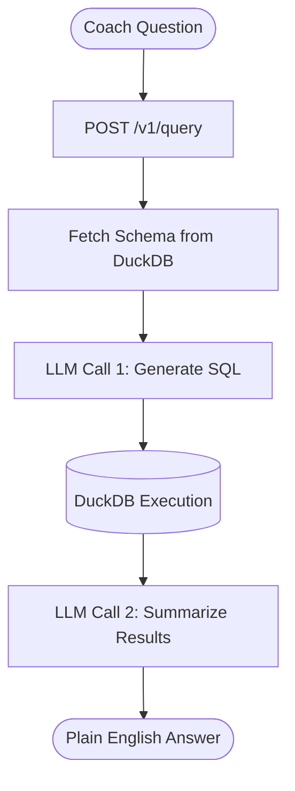

# FootballLLM

FootballLLM is a natural language querying interface over NFL Big Data Bowl tracking data, enabling coaches and analysts to ask questions in plain English and receive data-driven answers without writing SQL. The system uses a two-stage LLM pipeline — first generating a DuckDB query from the question, then summarizing the results in plain English — served via a FastAPI REST API backed by 9 weeks of NFL player tracking data. Built to demonstrate production-style ML infrastructure using Virginia Tech ARC's LLM API.

---

## Architecture



The gateway fetches the full database schema, including human-readable column descriptions stored in a metadata table, and injects it as context into the first LLM call. This allows the model to reason about the schema without any hardcoded query logic. The second LLM call receives the original question, the generated SQL, and the raw query results, and returns a 1-2 sentence plain English answer suitable for a coaching context.

---

## Tech Stack

- **FastAPI** — REST API gateway
- **DuckDB** — analytical database backend
- **VT ARC LLM API** — OpenAI-compatible LLM inference endpoint hosted on Virginia Tech's Advanced Research Computing infrastructure
- **SQLite** — request logging
- **Docker / Docker Compose** — containerization
- **GitHub Actions** — CI health check on every push

---

## LLM Backend

The system was originally designed to run inference locally using vLLM with a 
quantized Llama 3.1 8B model (AWQ INT4) on an RTX 5080. VRAM constraints, along with the 
the context length required for full schema injection, prompted a migration to 
Virginia Tech ARC's hosted LLM API, which provides access to significantly 
larger models including Kimi-K2.5 and gpt-oss-120b with no local hardware 
requirements. The OpenAI-compatible interface means switching between local 
vLLM and the ARC API requires changing only two lines of configuration — 
`API_URL` and `API_KEY` in `.env`.

---

## Endpoints

### `GET /v1/health`
Health check. No authentication required.

**Response**
```json
{"status": "ok"}
```

---

### `GET /v1/schema`
Returns the full database schema grouped by table, including column names, data types, and human-readable descriptions. Requires API key.

**Response**
```json
{
  "tables": {
    "players": [
      {"column_name": "nflId", "data_type": "INTEGER", "column_description": "Player identification number, unique across players"},
      ...
    ],
    ...
  }
}
```

---

### `POST /v1/query`
Accepts a natural language question and returns the generated SQL, raw results, and a plain English answer. Requires API key.

**Request**
```json
{
  "question_text": "Which receiver had the most receiving yards in week 1?"
}
```

**Response**
```json
{
  "question_text": "Which receiver had the most receiving yards in week 1?",
  "sql": "SELECT p.displayName, SUM(pp.receivingYards) AS total_receiving_yards FROM player_play pp JOIN games g ON pp.gameId = g.gameId JOIN players p ON pp.nflId = p.nflId WHERE g.week = 1 AND pp.hadPassReception = 1 AND p.position IN ('WR', 'TE') GROUP BY pp.nflId, p.displayName ORDER BY total_receiving_yards DESC LIMIT 1",
  "answer": "A.J. Brown had the most receiving yards in Week 1 with 155 yards.",
  "question_sql_token_usage": 312,
  "answer_token_usage": 48,
  "latency_ms": 4821.3,
  "model_used": "Kimi-K2.5"
}
```

---

## Setup

### Prerequisites

- Python 3.12
- NFL Big Data Bowl 2025 dataset (weeks 1-9) — available from [Kaggle](https://www.kaggle.com/competitions/nfl-big-data-bowl-2025)
- Access to VT ARC LLM API or other OpenAI compatible LLM API — more info at [llm.arc.vt.edu](https://llm.arc.vt.edu)

### Installation

```bash
git clone https://github.com/LoganLane/FootballLLM.git
cd FootballLLM
python -m venv .venv
source .venv/bin/activate
pip install -r requirements.txt
```

### Configuration

Copy `.env.example` to `.env` and fill in your values:

```bash
cp .env.example .env
```

```
API_URL=https://llm-api.arc.vt.edu/api/v1
API_KEY=your_arc_api_key_here
AUTH_KEY=your_generated_auth_key_here
```

Generate your `AUTH_KEY` with:

```bash
python -c "import secrets; print(secrets.token_hex(32))"
```

### Database Setup

Place the Big Data Bowl CSV files in a directory and edit the setup scripts to point to the path of your chosen directory. Then, run the scripts:

```bash
python populateCSVData.py
python populate_metadata.py
```

This creates `my_database.duckdb` with all tracking data loaded into a unified table and a `column_descriptions` metadata table used to provide the LLM with schema context.

### Running Locally

```bash
uvicorn main:app --port 8001
```

### Running with Docker

> **Note:** The VT ARC LLM API requires access to Virginia Tech's network. Run with `network_mode: host` (already configured in `compose.yaml`) while connected to the VT VPN.

```bash
docker compose up
```

---

## Data
> **Note:** The dataset may no longer be publicly available on Kaggle as of March 2026.
> 
> **Note:** The dataset covers a subset of games from the 2022 NFL regular season. Not all games from each week are included, which may result in totals that differ from official NFL statistics.
>
> 
This project uses the [NFL Big Data Bowl 2025](https://www.kaggle.com/competitions/nfl-big-data-bowl-2025) dataset, which contains Next Gen Stats player tracking data at 10 frames per second for weeks 1-9 of the 2022 NFL regular season. The dataset includes:

- **games.csv** — game-level metadata
- **plays.csv** — play-level information including formation, coverage, and down/distance
- **players.csv** — player identity and position
- **player_play.csv** — per-player per-play statistics
- **tracking_week_[1-9].csv** — frame-level player tracking (x/y coordinates, speed, acceleration, orientation)

All nine weekly tracking files are combined into a single `tracking_data` table at load time.

**Coordinate system:** `x` runs 0-120 yards along the length of the field (including both end zones), `y` runs 0-53.3 yards across the width. Player direction is encoded in the `playDirection` column.

---

## Example Queries

**Receiving yards leader**
> "Which receiver had the most receiving yards in week 1?"

*A.J. Brown had the most receiving yards in Week 1 with 155 yards.*

---

**Defensive coverage**
> "What was the most common defensive coverage in week 1?"

*Cover-3 was the most common defensive coverage in Week 1, used on 619 plays.*

---

**Player speed**
> "Who was the fastest player on average in week 2?"

*Dyami Brown was the fastest player on average in week 2.*

---

**Unknown player**
> "Did Hingle McCringleberry have a good game during week 1?"

*There are no statistics available for Hingle McCringleberry in week 1, which suggests he did not play in that game.*

---

## Notes

- **VT Network required:** The ARC LLM API is only accessible from Virginia Tech's network or via VPN. The Docker Compose file uses `network_mode: host` to share the host's VPN connection with the container.
- **Database not included:** The DuckDB file is excluded from the repository due to size. Follow the setup instructions above to build it from the raw CSV files.
- **Model:** Queries use `Kimi-K2.5` hosted on VT ARC infrastructure. The OpenAI-compatible API means any compatible model can be substituted by updating `API_URL` and `API_KEY` in `.env`.
- **Schema metadata:** Column descriptions are stored in a `column_descriptions` table within DuckDB and injected into the LLM system prompt at query time, providing semantic context beyond raw column names.
